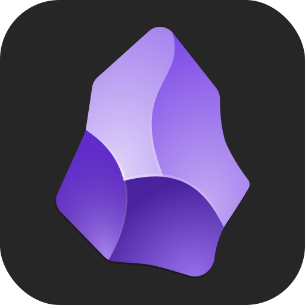

 

<h1 align="center">obsidian-vue-sample-plugin</h1>

    
    
    
    
    

 

    🌏
    <a href="#introduction">English</a>
    •
    <a href="#简单介绍">简体中文</a>
    🕊️

 

## Introduction

This is a Vue sample plugin for [Obsidian], and it should help get you started developing with [TypeScript] and [Vue 3] in [ESbuild].

This template depends on the latest Obsidian API (obsidian.d.ts).

**Note:** The Obsidian API is still in early alpha and is subject to change at any time!

## Recommended IDE Setup

- [vscode] - IDE.
- [Volar] - A vscode extension for Vue 3 language support.

## Quick Starting Guide for Using This Repo

- Check if [someone already developed a plugin for what you want]! There might be an existing plugin similar enough that you can partner up with.
- Make a copy of this repo as a template with the "Use this template" button (login to GitHub if you do not see it).
- Clone your repo to a local development folder. For convenience, you can place this folder in your `.obsidian/plugins/your-plugin-name` folder.
- Install [Node.js], then run `npm run chore` or `npm install` to install the package dependencies.
- Run `npm run dev` to compile your plugin to `main.js`. In this time, make changes to your TypeScript or Vue 3 code in the `src` folder, they will be automatically compiled to `main.js`.
- Reload Obsidian to load the newest version of your plugin, then enable your plugin in the Obsidian settings window.
- Run `npm run build` to compile your plugin to `main.js` in a release mode.

## Learn More

- [Obsidian Plugin Developer Docs] (author: [marcusolsson]).
- [Obsidian Plugin 中文开发文档] (translator: [luhaifeng666]).

## License

MIT license.

 

## 简单介绍

这是一个基于 Vue 的 [Obsidian] 插件开发模板, 它应该有助于您使用 [TypeScript] 和 [Vue 3] 同时搭配 [ESbuild] 进行开发.

此模板依赖于最新的 Obsidian API (obsidian.d.ts).

**请注意:** Obsidian API 目前仍处于早期的 alpha 阶段, 因此随时都有可能发生变动!

## 推荐的 IDE 配置

- [vscode] - IDE.
- [Volar] - 可以提供 Vue 3 语法支持的 vscode 插件.

## 使用此仓库的快速入门指南

- 检查[是否有人已经为您想要的东西开发了插件]! 可能已经有了一个跟您预期足够相似的现有插件, 您可以和它的开发者进行合作.
- 使用 "Use this template" 按钮将此仓库复制一份 (如果您没有看到这个按钮, 请先登录 GitHub).
- 将您的仓库克隆到本地. 为了方便起见, 您可以将仓库的内容放到 `.obsidian/plugins/your-plugin-name` 文件夹中.
- 安装 [Node.js], 然后运行 `npm run chore` 或 `npm install` 安装项目依赖.
- 运行 `npm run dev` 可以在开发模式下将插件编译为 `main.js`. 此时修改 `src` 文件夹中的 TypeScript 或 Vue 3 代码都可以自动热更新到 `main.js` 中.
- 重新启动 Obsidian 以加载最新版本的插件, 然后在 Obsidian 的设置窗口中启用插件.
- 运行 `npm run build` 可以在发布模式下将插件编译为 `main.js`.

## 了解更多

- [Obsidian Plugin Developer Docs] (作者: [marcusolsson]).
- [Obsidian Plugin 中文开发文档] (译者: [luhaifeng666]).

## 开源协议

MIT 协议.

[Obsidian]: https://obsidian.md
[TypeScript]: https://www.typescriptlang.org
[Vue 3]: https://vuejs.org
[ESbuild]: https://esbuild.github.io
[vscode]: https://code.visualstudio.com
[Volar]: https://marketplace.visualstudio.com/items?itemName=Vue.volar
[someone already developed a plugin for what you want]: https://obsidian.md/plugins
[Node.js]: https://nodejs.org
[Obsidian Plugin Developer Docs]: https://marcus.se.net/obsidian-plugin-docs
[marcusolsson]: https://github.com/marcusolsson
[Obsidian Plugin 中文开发文档]: https://luhaifeng666.github.io/obsidian-plugin-docs-zh
[luhaifeng666]: https://github.com/luhaifeng666

[是否有人已经为您想要的东西开发了插件]: https://obsidian.md/plugins
